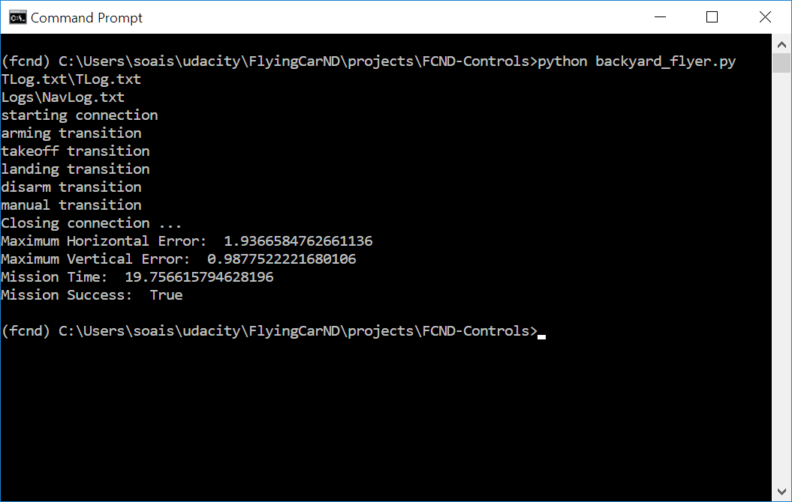
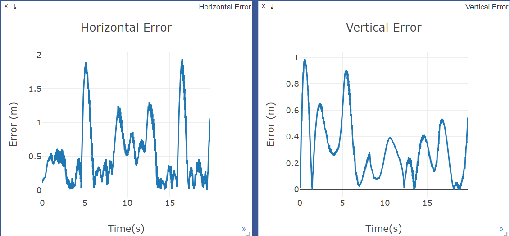
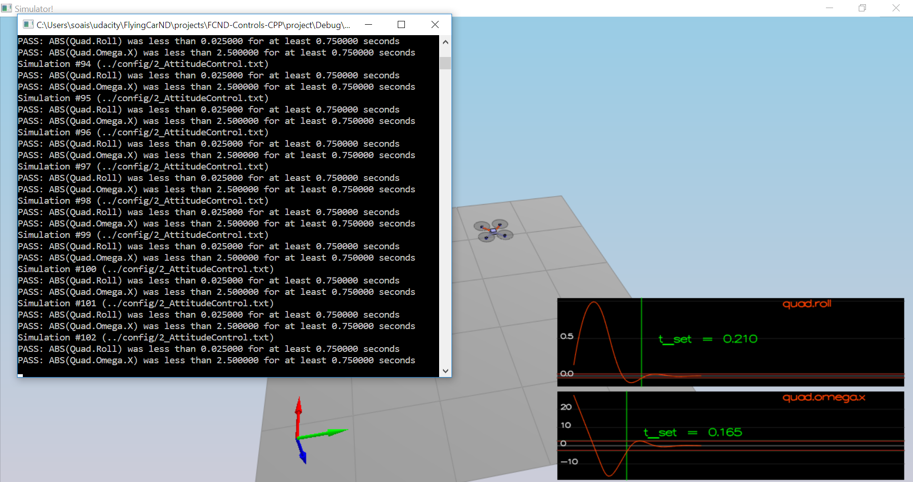
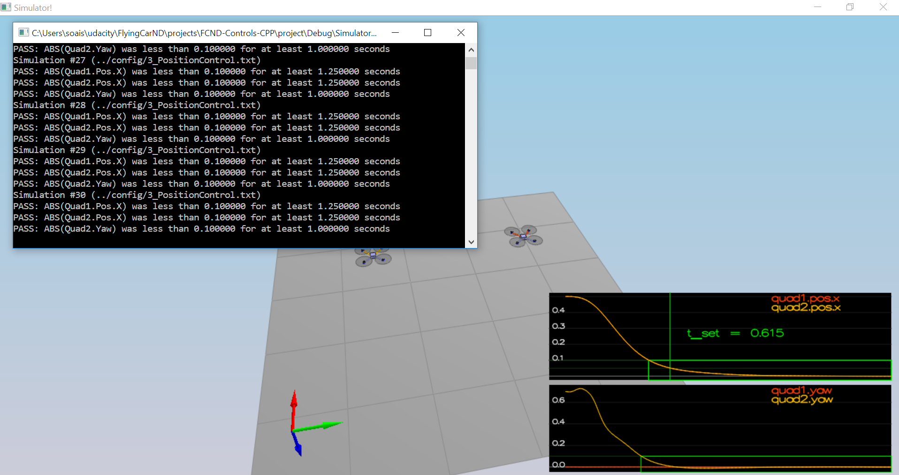
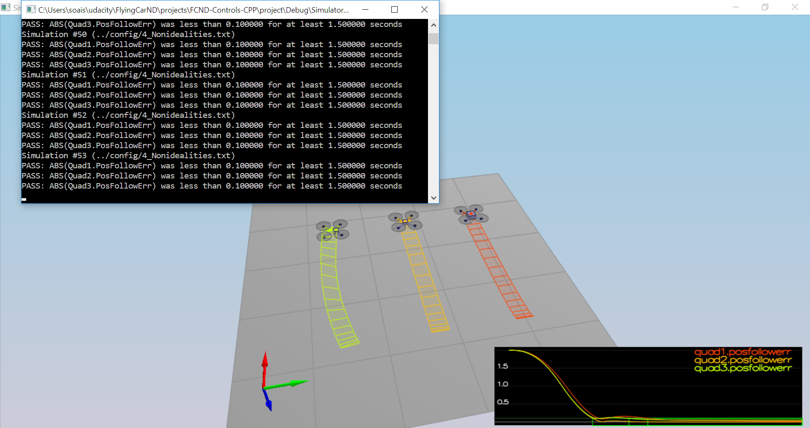
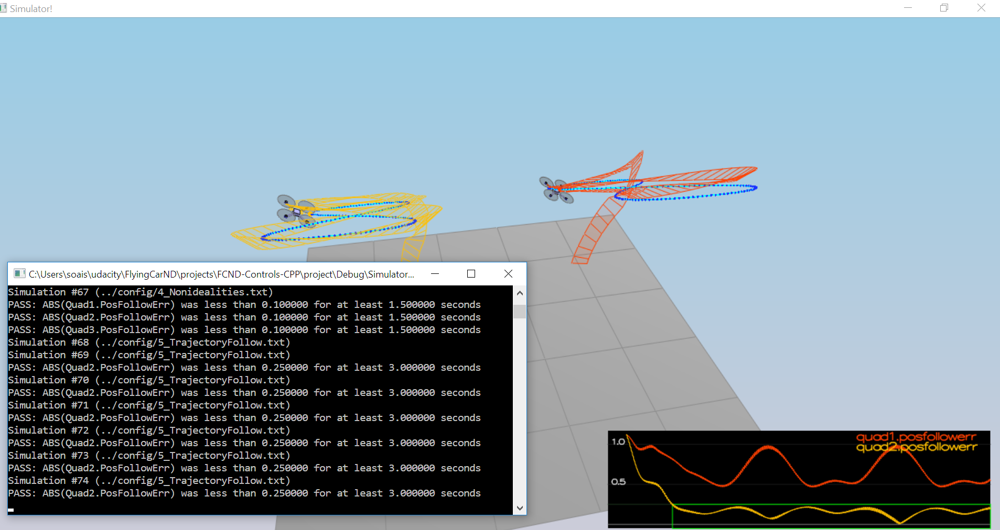

## Details on implementation

#### Body Rate Control
Python ->  this is implemented in function `body_rate_control(self, body_rate_cmd, body_rate)`. It is a simple proportional controller with `error = body_rate_cmd – body_rate_actual`. The total torque command  produced by controller is clipped to `MAX_TORQUE`.

C++ -> same logic is implemented in `QuadControl::BodyRateControl(V3F pqrCmd, V3F pqr)`. However in c++ case, the clipping does not happen at `MAX_TORQUE`. Rather the parameter to control is `thrust` at each motor level and this happens in function `QuadControl::GenerateMotorCommands`

#### Pitch Control

Python -> this is implemented in `roll_pitch_controller` function. The equation is same as the one given in course lesson “Full 3D Control” worksheet item 4.2. We also clip body pitch/roll rates to some limit MAX_TILT to ensure that drone stays stable.

C++ -> same logic is implemented in C++ in function `QuadControl::RollPitchControl`. However, in C++ case we need to first get `b_c` by converting the `accelCmd` values using equations
```c++
	float c = -collThrustCmd / mass;
	V3F b_c = V3F(accelCmd.x / c, accelCmd.y / c, 0.f);
```   

#### Altitude Control

Python-> in `altitude_control`. This is s PD controller in python case and thrust value is clipped to `MAX_THRUST`
C++ -> in function `QuadControl::AltitudeControl`. It is a full PID controller in C++ case. Also the clipping happens on velocity and not thrust. ```velZCmd = CONSTRAIN(velZCmd, -maxAscentRate, maxDescentRate)```.

#### Lateral Position control
Python -> this is implemented in `lateral_position_control` and it is a simple PD control working on lateral position and lateral velocity errors.

C++ -> This is implemented in `QuadControl::LateralPositionControl` and it is similar to the Python implementation.  The only additional thing in C++ case is the clipping that happens at velocity and acceleration values.

#### Yaw control
Python -> In function `yaw_control`
C++ -> in function `QuadControl::YawControl`

In both the cases, we take care to make sure that commanded yaw angle is between o and 2PI. Plus the yawRate produced by controller has a value between -PI to +PI

Motor Commands
In C++ version, we first formulate the four equations:
```C++
thrust = collThrustCmd;          // f0+f1+f2+f3
f_rot_x = momentCmd.x / l;       // f0-f1+f2-f3
f_rot_y = momentCmd.y / l;       // f0+f1-f2-f3
f_rot_z = - momentCmd.z / kappa; // f0-f1-f2+f3
```
Using above equations, we find individual values of f0, f1, f2, and f3. We then clip them to min and max values and then pass these clipped values to the motors.

 
### Flight Evaluation – Python.
Please find below the evidence of successful run in python






 
Evidence of successful mission completion in C++ - Please find below the evidence of successful run in C++

##### Scenario 2 – Attitude Control




##### Scenario 3 – Position Control




##### Scenario 4 – Non Idealities



##### Scenario 5 – Trajectory Follow


